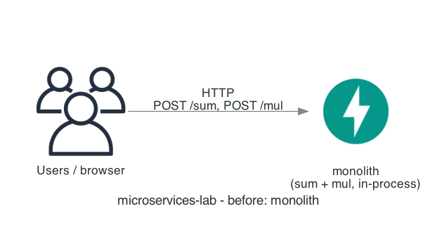
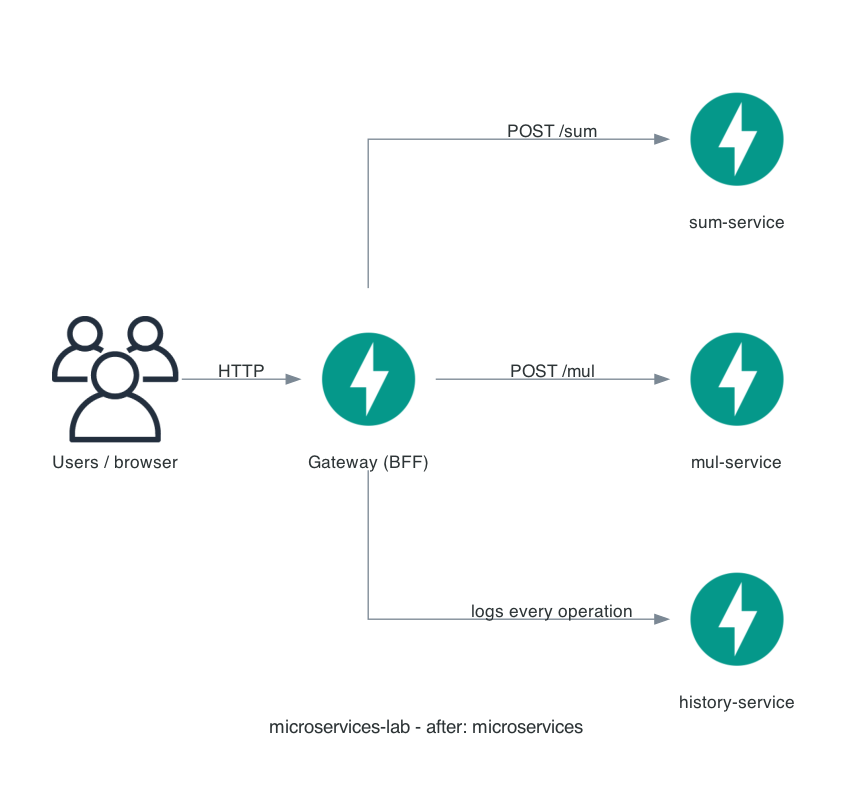

# microservices-lab — Monolith vs. Microservices, Interactively


A hands-on teaching platform for one question every backend engineer eventually has to answer:
**when — and how — do you split a monolith into microservices?** The same "sum" and
"multiply" operation runs two ways: once as a single in-process **monolith**, and once as a
real network of independent **microservices** (a gateway, two compute services, and a history
service) — and you can watch the difference. Every request returns a step-by-step trace of
which service handled it and how long each hop took, animated live in the browser, with a
performance comparison view backed by real historical latency data.

Built as a from-scratch, production-grade rewrite of a small teaching repo
([credit below](#credit--inspiration)), extended with a FastAPI backend, a React+TypeScript
frontend, and an optional Azure Container Apps deployment — with zero required secrets and
zero required local Docker.

## Why This Is Production-Grade

- **A real distributed trace, not a diagram** — the gateway generates an `X-Request-ID`
  correlation id, propagates it to every downstream call, and returns a structured
  `TraceHop[]` the frontend animates step-by-step. This is the actual "Distributed Tracing"
  observability pattern the Learn section teaches, made concrete instead of just described.
- **Deliberate, documented anti-pattern avoidance** — arithmetic logic is duplicated across
  `sum-service`, `mul-service`, and `monolith` on purpose, not shared, because a shared
  business-logic library forces lockstep redeploys across services (the "Shared Libraries"
  anti-pattern). Only the trace/health *schema contract* is shared (`services/common`) — see
  [Key Engineering Decisions](#key-engineering-decisions).
- **Independent deployability, structurally enforced** — every service has its own
  `pyproject.toml` and its own dependency set. No root `requirements.txt` ties them together.
- **Health checks + resilience baked in** — every service exposes `GET /health`; the
  gateway's `GET /api/health` fans out to all four downstream services concurrently and never
  fails outright if one is down (it reports `"status": "down"` for that service instead of
  crashing the whole check) — a real, testable circuit-breaker-adjacent resilience pattern.
- **No local Docker required, anywhere** — local development runs every service as a plain
  `uvicorn` process (`make run-local`). Deployed images are built *in Azure* via
  `az acr build`, sidestepping the Apple Silicon (arm64) vs. cloud (amd64) mismatch entirely.
- **Real automated verification** — 40+ pytest tests across 5 backend services (unit +
  endpoint + mocked-downstream integration), a Vitest frontend smoke test, and an 11-check
  end-to-end smoke test (`make smoke`) that exercises the real running stack, both modes, and
  confirms history is recorded correctly.
- **The migration is a real interactive process, not a static diagram** — the Migration page
  drives live traffic through progressively larger slices of the microservices path (0% → 25%
  → 50% → 75% → 100%), narrates each stage and every routed request in a live console, and can
  trigger a **real** Azure Container Apps deployment on request, streaming actual `az acr
  build`/deployment output into the browser and opening the live cloud URL when it's done.
- **A privileged action, actually protected** — the in-app "Deploy to Azure" trigger is gated
  by a localhost-only source-IP check *and* a random in-memory token (never persisted, never
  baked into the deployed image), specifically so it can't be triggered remotely or by anyone
  other than whoever is running the gateway process with their own `az` login.

## The Architecture

```
                         ┌─────────────────────────┐
   Browser ────────────► │   gateway (BFF, :8080)   │  ← external ingress (public)
  (React UI)              │  builds the trace, adds  │
                          │  X-Request-ID            │
                          └────────────┬─────────────┘
                                       │
                ┌──────────────┬───────┼────────────────┬───────────────┐
                ▼              ▼       ▼                ▼               │
        sum-service     mul-service   monolith    history-service       │
          (:8001)         (:8002)     (:8000)        (:8003)            │
        POST /sum        POST /mul   POST /sum,    SQLite-backed        │
                                      POST /mul     operation log        │
                                    (single hop,                        │
                                    in-process,                         │
                                    no network calls)                   │
                                                                          │
        mode=microservices → gateway → {sum|mul}-service → history-service
        mode=monolith       → gateway → monolith          → history-service
```

Every operation is logged to `history-service` regardless of mode, so
`GET /api/history/stats` can show a real, growing dataset comparing monolith vs. microservices
latency over time — not just a single sample.

| Before: Monolith | After: Microservices |
|---|---|
|  |  |

## Tech Stack

| Layer | Technology |
|---|---|
| Backend framework | FastAPI + Pydantic v2 + uvicorn |
| Language / runtime | Python 3.12 |
| Data store | SQLite via SQLModel (`history-service` only) |
| Inter-service calls | `httpx` (async) |
| Frontend | React 19 + TypeScript + Vite |
| Frontend routing | `react-router-dom` |
| Frontend styling | Plain CSS + custom properties (custom "Contoso" theme, no UI library) |
| Backend tests | pytest, `httpx.ASGITransport`, `respx` (mocked downstream calls) |
| Frontend tests | Vitest + React Testing Library |
| Local orchestration | Plain Python (`scripts/run_local.py`) — **no Docker** |
| Optional cloud deploy | Azure Container Apps, provisioned via Bicep, images built with `az acr build` |
| Diagram generation | `diagrams` (Python) + Graphviz |

## Prerequisites

- **Python 3.12** — required (matches every service's `pyproject.toml`)
- **Node.js 18+** (Vite/React frontend) and npm
- **No Docker required** for local development or testing
- **No API keys or secrets required** — this project makes no calls to any external API.
  Azure CLI login (`az login`) is the *only* credential involved, and only for the optional
  deploy path below.

## Setup

> **Crucial step — create the root `.venv` yourself before running `make install`.**
> `make install` expects `.venv/` to already exist (it only auto-creates the 5 *per-service*
> venvs at `services/<name>/.venv`, not the root one) and will fail immediately if it doesn't.
> Activating it (`source .venv/bin/activate`) isn't strictly required — every `make` target
> calls `.venv/bin/...` by explicit path — but do it anyway so `python`/`pip` resolve correctly
> if you run anything by hand.

```bash
git clone <your-fork-url> microservices-lab
cd microservices-lab

python3.12 -m venv .venv
source .venv/bin/activate

make install   # installs services/common + dev tooling into .venv, creates + installs
               # each of the other 5 services into its OWN venv, then npm install in frontend/
```

## Running the Project

### Run everything locally (recommended — no Docker)

```bash
make run-local
```

This starts all 5 backend services (`sum-service` :8001, `mul-service` :8002, `monolith`
:8000, `history-service` :8003, `gateway` :8080) plus the Vite frontend dev server, each as a
plain `uvicorn`/`npm run dev` subprocess, with interleaved `[service-name]`-prefixed logs.
Press `Ctrl+C` to stop everything cleanly.

Then open **http://localhost:5173** (Vite dev server, which proxies `/api` → the gateway on
`:8080`).

### Run the test suite

```bash
make test
```

Runs every backend service's pytest suite independently (`pytest services/<name>` — not one
combined run, since sibling services intentionally don't share a test root, matching their
independent-deployability principle) plus the frontend's Vitest suite.

### Run the full end-to-end smoke test

```bash
make smoke
```

Starts the real stack, waits for all 5 services to report healthy, exercises
`POST /api/operations/{sum,mul}` in **both** modes, confirms history was recorded, checks
`/api/history/stats`, prints a PASS/FAIL checklist, and shuts everything down — safe to re-run
any time. See [Testing](#testing) below for the exact checklist.

### Deploy to Azure (optional)

Not required to run or evaluate this project. See **[`azure/README.md`](azure/README.md)**
for the full guide — cost estimate, deploy/teardown/verify instructions, and why **Azure
Container Apps** (not AKS, not ACI) was chosen.

```bash
make azure-deploy     # builds images in Azure via `az acr build`, no local Docker
make smoke-azure       # same checks as `make smoke`, against the live URL
make azure-teardown    # deletes everything
make azure-verify      # confirms nothing is left behind
```

**Or trigger it from the app itself.** The Migration page's "🚀 Deploy to Azure" button runs
the exact same `deploy.sh` flow in the background and shows you exactly what to expect while
it runs:

- The button switches to a disabled **"Deploying to Azure…"** state and the console below it
  streams every line of real `deploy.sh` output live (polled every ~700ms) — the same output
  you'd see running `make azure-deploy` in a terminal, including the Phase A / Phase B
  progression and any auto-incremented resource names.
- **This takes several minutes** (Phase A provisions the ACR, Log Analytics workspace, and
  Container Apps Environment; Phase B builds all 5 images in Azure via `az acr build` and
  rolls out the real containers) — there's no fixed timeout, so just leave the tab open and
  watch the console.
- **On success**, the deployed gateway's public URL automatically opens in a **new browser
  tab** — that's the unambiguous "it's done" signal, no need to watch the console for a
  specific line — and the same URL also appears as a clickable link on the page.
- **On failure**, the console stops and an error banner explains why; the button becomes
  clickable again so you can fix the issue and retry.

This only works when you're running the app locally on your own machine, logged into your
own `az` CLI: the endpoint requires the request to originate from `127.0.0.1`/`::1` *and*
carry a random token generated fresh in memory each time the gateway process starts (never
written to disk, never present in the deployed Azure image, which has no `az` CLI at all) — so
it can't be triggered remotely and can't spend anyone else's Azure budget. See the docstring in
`services/gateway/app/migration_control.py` for the full threat-model writeup.

## Project Structure

```
microservices-lab/
├── services/
│   ├── common/            # shared trace/correlation-id/health SCHEMA only — not business logic
│   ├── sum-service/        # FastAPI, owns POST /sum
│   ├── mul-service/        # FastAPI, owns POST /mul
│   ├── monolith/           # FastAPI, both operations in-process, 1-hop trace, for comparison
│   ├── history-service/    # FastAPI + SQLModel + SQLite, logs every operation
│   └── gateway/            # FastAPI BFF: orchestrates, builds the trace, serves the built frontend
├── frontend/                # React + TypeScript (Vite), Contoso theme
├── scripts/
│   ├── run_local.py         # launches all 5 services + frontend as plain Python subprocesses
│   ├── check_prereqs.sh     # validates Python/Node versions (no Docker check)
│   └── smoke_local.sh       # full end-to-end smoke test, see below
├── azure/                   # optional Azure Container Apps deploy (Bicep + scripts)
├── diagram/generate_diagram.py
├── data/{monolith.png,microservices.png}   # before/after architecture diagrams
├── Makefile
├── NOTICE.md                 # credit to the original repo this project is based on
└── README.md
```

## Testing

`make smoke` runs an 11-check end-to-end suite against the real, running stack:

| # | Check | What it proves |
|---|---|---|
| 1 | Prerequisite check | Python 3.12 + Node present before anything starts |
| 2–6 | Each of the 5 services becomes healthy | Every process actually started and is serving, not just running |
| 7 | `sum`, `mode=microservices` | Gateway → sum-service → history-service, ≥2 trace hops, correct result |
| 8 | `sum`, `mode=monolith` | Gateway → monolith → history-service, correct result |
| 9 | `mul`, `mode=microservices` | Second operation type works end-to-end |
| 10 | `GET /api/history` | Prior operations were actually recorded |
| 11 | `GET /api/history/stats` | Both modes present with `count >= 1`, powering the Compare Performance page |

Plus, independent of the smoke test: 40+ `pytest` unit/endpoint/integration tests across all 5
backend services (arithmetic correctness, request validation, DB round-trips, mocked-downstream
gateway orchestration including a "one downstream is down but `/api/health` still returns 200"
resilience test), and a frontend Vitest smoke test.

## Key Engineering Decisions

| Decision | Reasoning |
|---|---|
| Duplicate arithmetic logic across `sum-service`/`mul-service`/`monolith` instead of a shared library | The PDFs' "Shared Libraries" anti-pattern: a shared business-logic dependency forces synchronized deployments across services, which defeats the entire point of independent deployability. The duplication cost here (4 lines) is negligible; the teaching value is real. |
| `services/common` shared for trace/correlation-id/health schemas only | This is an *integration contract*, not business logic — real platform teams do standardize this (analogous to a shared OpenAPI spec), and duplicating it across 5 services would risk silent drift in exactly the observability story this project is trying to demonstrate. |
| Per-service `pyproject.toml`, no root requirements file | Bumping a dependency in one service should never force a rebuild of the others — this is independent deployability made structurally true, not just asserted. |
| Server-built trace, client-animated (no SSE/WebSocket streaming) | Simpler, no extra infrastructure, and just as effective at showing the request's path — the interesting information (which service, how long) is fully known once the response completes. |
| History logged for every operation, in every mode | Turns "Compare Performance" from a single anecdotal sample into a real, growing dataset — the latency gap between modes becomes statistically visible, not just claimed. |
| Plain-Python local dev (`scripts/run_local.py`), no Docker Compose | Removes local Docker entirely from the dev loop — no arm64 build friction, no Docker Desktop dependency, works identically everywhere Python does. |
| No Kubernetes manifests | Local Kubernetes (`minikube`/`kind`) also requires a local Docker daemon, which this project deliberately avoids; Azure Container Apps covers the "real deployed orchestration" story without that dependency. |
| Azure Container Apps over AKS for the optional cloud path | ACA scales to zero and bills per-second with no VM/node to keep running; AKS requires at least one always-on node just to exist. For 5 tiny services that mostly sit idle, ACA is materially cheaper with no loss of portfolio value. See `azure/README.md`. |
| Images built via `az acr build`, never locally | Sidesteps the Apple Silicon (arm64) vs. Azure (amd64) architecture mismatch entirely — the build always happens on Azure's infrastructure. |

## Troubleshooting & Lessons Learned

Real problems hit (and fixed) while building and actually deploying this project — kept here
deliberately rather than quietly editing history, since diagnosing and fixing them was part of
the engineering, not a footnote.

| Symptom | Root Cause | Fix |
|---|---|---|
| `pytest services/monolith` returned 404 on every endpoint, despite the routes clearly existing in `app/main.py` | Every backend service's FastAPI app lives in a top-level package literally named `app`. All 5 were installed editable into **one shared venv**, so only the *last-installed* service's `app` package actually resolved at import time — `from app.main import app` silently imported a different service's app depending on install order. Runtime (`uvicorn`, launched with `cwd=services/<name>`) wasn't affected, only the shared test/install environment was — which is why `make smoke` passed while `make test` quietly broke. | Gave each service its **own venv** (`services/<name>/.venv`, created by `make install`). Smaller and more correct than renaming 5 packages, and it matches the project's own "no shared runtime between independently-deployable services" principle. |
| The architecture diagram silently disappeared from `data/` | `.gitignore` had a blanket `data/` rule intended to ignore `history-service`'s runtime SQLite directory, but it matched **any** directory named `data` at any depth — including the root `data/` folder holding the committed diagrams. | Narrowed the rule to `services/*/data/`, which is what was actually meant to be ignored. |
| Auto-mode's safety classifier blocked wiring in the "Deploy to Azure" button | The first version of `POST /api/migrate/azure/deploy` was a **plain, unauthenticated HTTP endpoint** that could trigger a real, billable Azure deployment for anyone who could reach it — the reasoning "it only works if `az` is logged in on that machine" is true but doesn't add any actual access control to the endpoint itself. | Added a localhost-only source-IP check *and* a random in-memory token, generated fresh each gateway start and bootstrapped via a separate localhost-gated `/token` endpoint. This also closes a CSRF gap: a malicious page in another tab can blindly fire the POST, but can't read the token endpoint's response (blocked by the browser's same-origin policy) to attach a valid token. |
| Real Azure deploy, Phase A failed: `ContainerAppInvalidName: 'microservices-lab-history-servic (trimmed)'... length must be between 2 and 32` | Azure Container App names are capped at **32 characters**. The default project name (`microservices-lab`, 18 chars) plus the longest derived suffix (`-history-service`, 16 chars) = 34 characters — over the limit. This wasn't caught by `az bicep build` (that only validates ARM syntax, not Azure-side naming rules) or by local review before the first real deploy attempt. | Shortened the default `projectName` to `ms-lab` and added a Bicep `@maxLength(16)` guard on the parameter so this class of error fails fast and locally instead of burning a real deployment attempt. |
| Caught in review *before* it could fail a real deploy: ACR has `adminUserEnabled: false` (a deliberate, good security default), but nothing in the Bicep template actually granted any identity permission to pull from it | A top-of-file comment described the intended design ("Container Apps pulls via managed identity + AcrPull role assignment") but the actual `Microsoft.ManagedIdentity` and `Microsoft.Authorization/roleAssignments` resources were never added — documentation drifted from implementation. Had this shipped as-is, Phase B would have failed the moment any Container App tried to pull a real (non-placeholder) image from the private registry. | Read the Bicep template personally before the real deploy run (not just trusting it compiled) and added a single user-assigned managed identity with the built-in `AcrPull` role, scoped *only* to this ACR, attached to all 5 Container Apps. |
| First live deploy: gateway container came up `CrashLoopBackOff`, `restartCount` climbing | `services/gateway/app/migration_control.py` computed `REPO_ROOT = Path(__file__).resolve().parents[4]` — a fixed index that happened to work in local dev only by accident (the local absolute path has enough parent directories to not raise, even though the index itself was already off-by-one for this file's actual depth). Inside the deployed container, the file lives at a much shallower `/app/app/migration_control.py`, so `parents[4]` raised a bare `IndexError` **at module import time**, crashing the whole gateway before it could serve anything. | Replaced the hardcoded index with a directory walk that looks for a marker file (`azure/scripts/deploy.sh`) and falls back to a harmless sentinel if not found, so it degrades gracefully in the container instead of crashing. Added 2 regression tests simulating the shallow-filesystem case. |
| After rebuilding and pushing a fixed gateway image, `az containerapp update --image ...` reported success but the live app kept crashing with the *old* code | Azure Container Apps only creates a new revision (and re-pulls) when the image **reference string** changes — pointing at the same `<acr>/gateway:latest` tag string that was already configured, even after rebuilding what that tag points to, is a silent no-op. | Forced a genuinely new revision with `az containerapp update --image ... --revision-suffix <new-value>`. Documented in `azure/README.md`. |
| `make run-local`/`make smoke` failed with "address already in use" on every backend port — and separately, a `make smoke` run once reported "11 passed" despite those same bind errors appearing in its own log | A previous `make run-local` was still running in a different terminal. The freshly-spawned processes couldn't bind (correct error), but the smoke test's health-check polling doesn't care *which* process answers — it found the *other*, already-running instance's services healthy and happily checked against those instead, masking that its own spawned processes had all crashed. | `scripts/run_local.py` now detects leftover processes from a prior run of this same stack (verified via each process's own command line, never killed just because it's on the port) and stops them automatically before starting; if a port is still busy afterward, it fails immediately with one clear message instead of a wall of per-service bind errors. |

**General lessons for anyone extending this project:**
- Run `az bicep build --file azure/main.bicep --stdout` yourself before any real deploy — it catches syntax errors, but **not** Azure-side semantic limits like resource name length, which only surface at actual deployment time.
- A shared local venv across multiple same-named Python packages is a trap even in a "just for local dev convenience" setting — prefer per-service isolation from the start.
- `.gitignore` patterns without a leading `/` match at every depth — scope them explicitly (`services/*/data/`, not `data/`) whenever the intent is narrower than "ignore this name everywhere."
- Any endpoint that can trigger a real-world side effect (spending money, provisioning infrastructure, sending something) needs real access control, not just "well, it'll fail gracefully if you're not set up for it."
- Never hardcode a directory-depth assumption (`parents[N]`) in code that might run from more than one deployment shape — a container image is almost never the same directory depth as a local checkout.
- A live deployment isn't verified until you've actually checked replica health and logs, not just that the deployment command exited 0 — `provisioningState: Succeeded` only means Azure accepted the *request*, not that the container is actually running.

## Learn: Microservices Fundamentals

The app itself ships an in-product "Learn" section (sidebar → LEARN → **What Are
Microservices?**) built from three migration/architecture references. It's a single scrollable
page rather than several separate ones — "What Are Microservices?" renders first, followed by
an in-page index that jumps down to the rest: the **Strangler Fig migration pattern** (7-step
incremental cutover, and why not a "Big Bang" rewrite), **service boundaries and anti-patterns**
(Conway's Law, Two-Pizza Teams, Distributed Monolith, Shared Persistence, Megaservice, Cyclic
Dependency, "Wrong Cuts"), **observability and resilience** (API Gateway responsibilities,
distributed tracing, circuit breakers, Chaos Monkey), **when NOT to use microservices**, and a
full glossary. Every concept links back to where it's demonstrated live in the app (the trace
timeline *is* distributed tracing; the health page *is* the health-check pattern).

## Credit / Inspiration

This project began as a from-scratch, production-grade extension of
[Senhaji-Rhazi-Hamza/kube-python-micro-services-example](https://github.com/Senhaji-Rhazi-Hamza/kube-python-micro-services-example)
(MIT License) — a small Flask teaching repo demonstrating the same monolith-vs-microservices
"sum/mul" pattern, which is itself cited as a reference example in one of the migration guides
this project's Learn section is built from. See [`NOTICE.md`](NOTICE.md).

## Author

**Marcos Oliveira** — [LinkedIn](https://www.linkedin.com/in/mfilho1/) | [GitHub](https://github.com/MAOFILHO)
